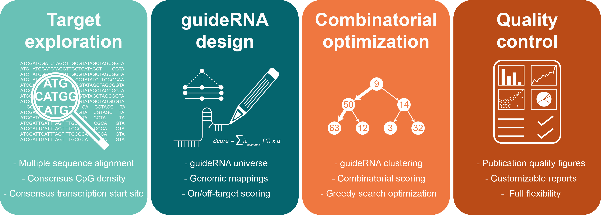

***Repguide*** is an [R-package](https://tanaylab.github.io/Repguide/index.html), developed to facilitate the design of guideRNAs for CRISPR/dCAS9 targeting of repetitive DNA sequences, such as those derived from transposable elements.

The web tool includes  full functionality of the Repguide R-package and allows users with no programming experiences to design their own guideRNAs.

 
 

***Functionality***
 
The basic workflow consists of exploring and selecting target sites, computing the guideRNA universe, and finding the optimal combination of guides that maximizes target-specific coverage.

 

 

Once you selected the ***Guide design*** tab, you are only three clicks away from your final guideRNA set to perform genome wide targeting of repetetive DNA sequences. For each of the three steps (1.Target exploration; 2.Guide design; 3.Guide combination), publication ready figures are generated, which will help you select the optimal options for the follwing step in the workflow. Default options for a quick guideRNA design are already selected. 

 

***Features include:*** Multi-species support, Flexible genome annotation, Black- and whitelisting, Multiple sequence alignment, Promoter identification, Consensus positional targeting, Genome-wide mapping, On and off-target scoring, Combinatorial optimization (multiple guides), High-quality reports

 
 

***Contributions***
 
The Repguide web tool has been developed by:

Division of Cancer Epigenomics, German Cancer Research Center (DKFZ) Heidelberg, Germany  

[Cancer Epigenomics](https://www.dkfz.de/en/CanEpi/index.php)

Contact: 
[Joschka Hey](mailto:j.hey@dkfz.de)

 

The Repguide R-package has been developed by:

Division of Epigenomics and Evolution, Weizmann Instittute of Science (WIS), Rehovot Israel  

[Epigenomics and Evolution](http://compgenomics.weizmann.ac.il/tanay/)

Contact:
[David Brocks](mailto:davidbrocks87@googlemail.com)

 

